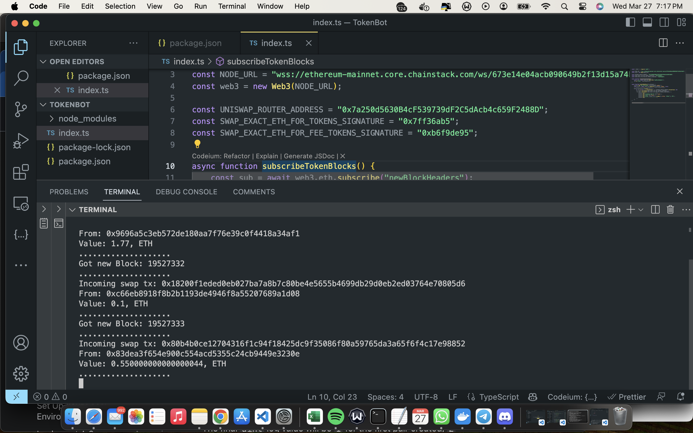

# Uniswap Token Swap Listener

## Overview

This project is a listener designed to detect token swaps occurring on the Uniswap decentralized exchange (DEX). It utilizes the Web3 library to interact with the Ethereum blockchain and subscribes to new block headers to monitor incoming transactions.

## Features

- Subscribes to new block headers to detect Ethereum transactions.
- Filters transactions to identify token swaps executed through Uniswap.
- Logs details of incoming token swap transactions, including transaction hash, sender address, and swapped token value.

# TokensSwapBot
